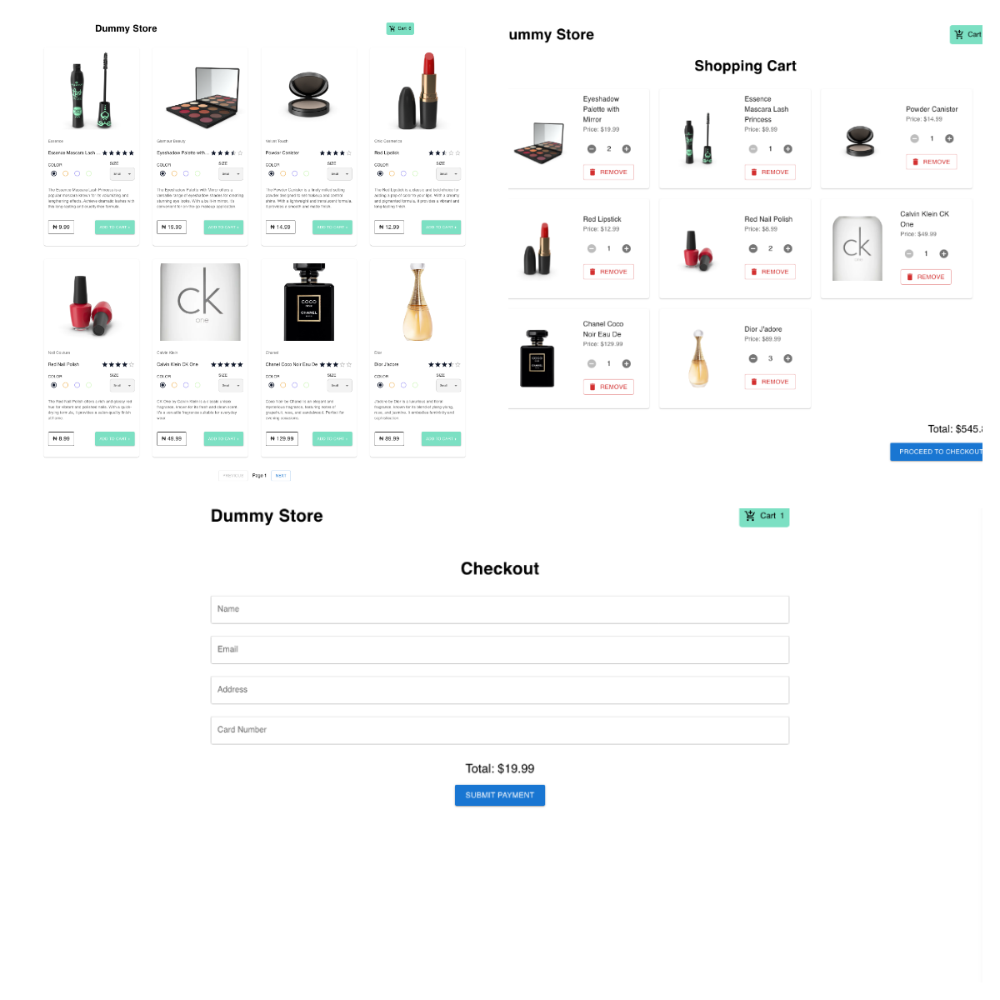

# **E-commerce Store App**

This is a simple e-commerce store built with **React TypeScript**, **React Query**, **React Router**, **Context API**, and **Material UI**, using **Vite** and **Yarn** as tools. The app allows users to browse products, add items to the cart, and proceed through a checkout process. The app also features pagination for product browsing and manages the cart state globally.



## **Features**
- **Product Listing**: Fetch and display products from an API (`dummyjson.com/products`).
- **Pagination**: Browse products with pagination, showing 8 products per page.
- **Shopping Cart**: Users can add products to the cart, update quantities, and view the total price.
- **Checkout Form**: Collect user details (name, email, address, and card number) for completing purchases.
- **State Management**: Context API is used for managing cart state across the application.
- **Error Handling**: Provides feedback when there's an error fetching product data.
- **Responsive Design**: Works across devices with Material UI for a clean, minimalist look.


## **Project Structure**

```
src/
│── api/
│   └── products.ts        # API functions to fetch product data
│── components/
│   └── ProductCard.tsx    # Component for rendering individual product cards
│   └── Navbar.tsx         # Navbar with shopping cart icon
│── context/
│   └── CartContext.tsx    # Context API for managing cart state
│── pages/
│   └── Home.tsx           # Home page displaying product listing
│   └── Cart.tsx           # Cart page to manage items in cart
│   └── Checkout.tsx       # Checkout form page
│── types/
│   └── types.ts           # Type definitions for TypeScript
│── App.tsx                # Main app file with routing
│── main.tsx               # Entry point to render app
│── index.css              # Global CSS file
```

## **Tech Stack**
- **React TypeScript**: Used for building interactive user interfaces with type safety.
- **React Query**: For data fetching, caching, and synchronization with the API.
- **React Router**: For managing page navigation.
- **Context API**: For global state management (cart state).
- **Material UI**: For creating a clean, responsive UI.
- **Vite**: For fast builds and development experience.
- **Yarn**: Dependency management and package installation.


## **Getting Started**

### **Prerequisites**

- **Node.js** (>= 14.x.x)
- **Yarn** (>= 1.x.x)

Ensure you have the following installed:
```bash
node -v
yarn -v
```

### **Installation**

1. **Clone the repository:**
   ```bash
   git clone https://github.com/taofiqsulayman/test-ecommerce-app.git
   ```

2. **Navigate to the project directory:**
   ```bash
   cd test-ecommerce-app
   ```

3. **Install dependencies:**
   ```bash
   yarn install
   ```

### **Running the App Locally**

1. **Start the development server:**
   ```bash
   yarn dev
   ```

2. **Open your browser and go to:**
   ```bash
   http://localhost:5173
   ```

### **Building for Production**

To build the project for production, run:

```bash
yarn build
```

This will create a `dist/` directory with the production build.

### **Running Tests**

1. To run the test suite using **Jest** and **Testing Library**, execute:
   ```bash
   yarn test
   ```

2. The tests will run automatically, and you can check the results in the terminal.


## **API Information**

The app uses the `dummyjson.com/products` API to fetch product data. The following API functionalities are used:

- **GET** `/products`: Fetches all products with pagination support (`limit` and `skip` parameters).
- The `limit` is set to 8 products per page, and `skip` is calculated as `(page - 1) * limit` to handle pagination.

### **Sample API Request**

```bash
https://dummyjson.com/products?limit=8&skip=0
```

This request fetches the first 8 products. You can adjust the `limit` and `skip` parameters for pagination.


## **App Functionality**

### **Home Page**
- Displays a grid of 8 product cards per page.
- Product details include the product name, price, rating, and image.
- Pagination controls (Previous/Next) allow navigation between pages.

### **Product Card**
- Each card shows:
  - Product image, name, and price.
  - Buttons for **Add to Cart** and **Wish List**.
  - Rating system (5-star scale).

### **Shopping Cart**
- Items can be added to the cart via the **Add to Cart** button.
- Quantity can be adjusted from the cart, and the total cost is updated accordingly.
- Items can be removed from the cart.

### **Checkout Page**
- Form collects user details (name, email, address, and card number) with validation.
- Displays a confirmation upon successful form submission.

### **State Management**
- **Cart Context** is used to globally manage the cart's state.
- The cart is persistent across pages and is accessible from the navigation bar.


## **Error Handling**

The app includes error handling for the following:
- **API Errors**: Displays a user-friendly error message if the product data cannot be fetched.
- **Form Validation**: Ensures all required fields in the checkout form are completed before submission.


## **Contributing**

1. **Fork the repository.**
2. **Create a new feature branch**: `git checkout -b my-feature`
3. **Commit your changes**: `git commit -m 'Add a new feature'`
4. **Push to the branch**: `git push origin my-feature`
5. **Submit a pull request**


## License

This project is licensed under the MIT License.


## Contact

For questions or collaboration, feel free to contact [sulaymantaofiq@gmail.com].